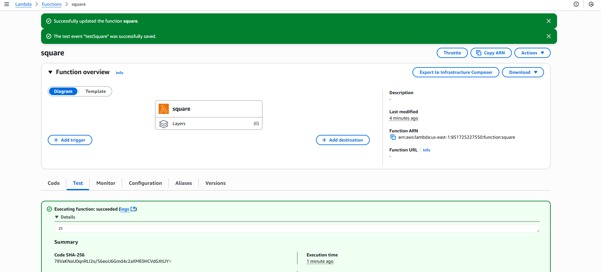
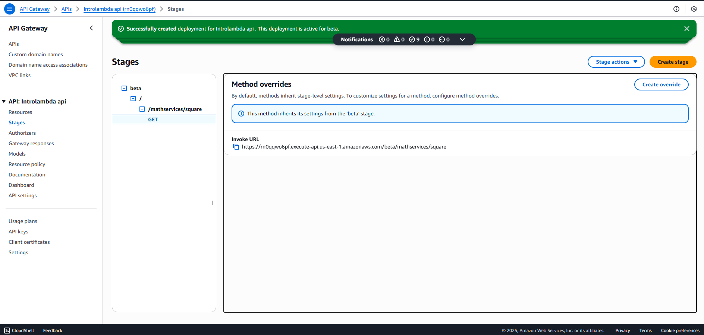
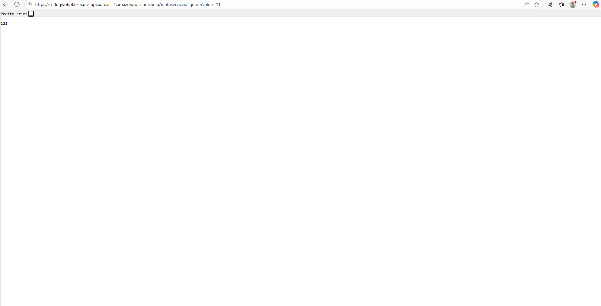

# Taller: AWS Lambda + API Gateway (Java)

Guía paso a paso para compilar, desplegar y probar una función AWS Lambda en Java, y publicarla mediante API Gateway.



## Resumen

Este repo contiene un módulo Maven (`lambda/`) con clases simples en Java 21. Usaremos la función `co.edu.escuelaing.lambda.MathServices::square` como handler de Lambda. Esta función recibe un número (JSON) y retorna su cuadrado.

Estructura relevante:

- `lambda/pom.xml`: configuración Maven (Java 21)
- `lambda/src/main/java/co/edu/escuelaing/lambda/MathServices.java`: función `square(Integer)`

> Nota: Hay otras clases de ejemplo en el paquete, pero el despliegue que cubrimos aquí usa únicamente `MathServices::square`.

## Prerrequisitos

- Cuenta de AWS con permisos para Lambda y API Gateway.
- Java 21 (Corretto recomendado) y Maven 3.8+ instalados.
- AWS CLI v2 opcional (para despliegue por línea de comandos) y perfil configurado (`aws configure`).
- Región objetivo (ej. `us-east-1`).

## 1) Compilar y empaquetar

Desde la raíz del repo, compila el módulo `lambda` para generar el JAR:

```powershell
mvn -q -f .\lambda\pom.xml -DskipTests package
```

Salida esperada:

- `lambda/target/lambda-1.0-SNAPSHOT.jar`

Como el proyecto no usa dependencias externas, no es necesario crear un “fat jar”.

## 2) Despliegue en AWS Lambda (Consola)

1. Abre AWS Console → Lambda → Create function.
2. Elige “Author from scratch”.
	 - Name: `square-java`
	 - Runtime: `Java 21 (Corretto)`
	 - Architecture: `x86_64` (o `arm64` si lo prefieres)
	 - Permissions: usa una role básica con permisos para escribir logs en CloudWatch.
3. Crea la función.
4. En Code → “Upload from” → “.zip or .jar file” y sube `lambda-1.0-SNAPSHOT.jar`.
5. En la pestaña Configuration → General configuration:
	 - Handler: `co.edu.escuelaing.lambda.MathServices::square`
	 - Memory: 512 MB (sugerido)
	 - Timeout: 10 s (sugerido)
6. Guarda los cambios.

### Probar en la consola de Lambda

1. Tab “Test” → Configure test event.
2. En Event JSON escribe un número (JSON válido), por ejemplo:

```json
7
```

3. Ejecuta Test. Deberías obtener `49` como resultado.

## 3) Exponer la función con API Gateway (REST API con mapping)

La firma `square(Integer)` espera un número JSON “crudo”. Para usar API Gateway, crea una REST API con un “Mapping Template” que transforme el body de la petición al número que espera Lambda.

Pasos:

1. AWS Console → API Gateway → Create API → “REST API” (Build).
2. Crea un recurso, por ejemplo `/square`.
3. Crea un método `POST` sobre `/square` con integración “Lambda Function” → selecciona la función `square-java`.
4. En “Integration Request” → “Mapping Templates”:
	 - Content-Type: `application/json`.
	 - Template: si el cliente envía `{ "value": 7 }`, usa:

```
$input.json('$.value')
```

	 - Si el cliente envía el número crudo (ej. body `7`), entonces:

```
$input.body
```

5. Deploy API (por ejemplo al stage `prod`).
6. Invoca `POST https://<api-id>.execute-api.<region>.amazonaws.com/prod/square` con un body como `{ "value": 7 }` y `Content-Type: application/json`.



### Probar desde PowerShell o Postman

Ejemplo con `Invoke URL` del stage `prod` y `{ "value": 8 }`:

```powershell
Invoke-RestMethod -Method Post -Uri "https://<api-id>.execute-api.<region>.amazonaws.com/prod/square" -ContentType "application/json" -Body '{"value":8}'
```

Respuesta esperada: `64` (como número en el cuerpo de la respuesta).



> Alternativa: puedes implementar un handler “proxy” (RequestHandler<APIGatewayProxyRequestEvent, APIGatewayProxyResponseEvent>) y evitar los templates. En este repo no está incluido; la ruta con template es la más directa para `square(Integer)`.

## 4) Despliegue por AWS CLI (opcional)

Con AWS CLI v2 y el perfil configurado:

```powershell
# 1) Crear función (si no existe)
aws lambda create-function `
	--function-name square-java `
	--runtime java21 `
	--role arn:aws:iam::<ACCOUNT_ID>:role/<ROLE_CON_PERMISOS_DE_LOGS> `
	--handler co.edu.escuelaing.lambda.MathServices::square `
	--zip-file fileb://lambda/target/lambda-1.0-SNAPSHOT.jar `
	--timeout 10 `
	--memory-size 512 `
	--region <REGION>

# 2) Actualizar el código (si ya existe)
aws lambda update-function-code `
	--function-name square-java `
	--zip-file fileb://lambda/target/lambda-1.0-SNAPSHOT.jar `
	--region <REGION>

# 3) Actualizar configuración del handler (si hiciste cambios)
aws lambda update-function-configuration `
	--function-name square-java `
	--handler co.edu.escuelaing.lambda.MathServices::square `
	--runtime java21 `
	--timeout 10 `
	--memory-size 512 `
	--region <REGION>
```

Para exponer por API Gateway vía CLI, se recomienda usar SAM/CloudFormation o CDK. Para la prueba rápida, la consola de API Gateway es más sencilla.

## Troubleshooting

- “Handler ‘…’ not found” o `ClassNotFoundException`:
	- Verifica el nombre completo del handler: `co.edu.escuelaing.lambda.MathServices::square`.
	- Asegúrate de que el paquete/clase compiló dentro del JAR.
- `UnsupportedClassVersionError`:
	- Estás usando runtime distinto a Java 21. Cambia a `Java 21 (Corretto)` o recompila para la versión que elegiste.
- Timeouts o latencia alta:
	- Sube memoria a 512–1024 MB y ajusta timeout.
- API Gateway retorna error 502/500:
	- Revisa el Mapping Template y el formato del body. La función espera un número JSON, no un objeto.

## Limpieza (evitar costos)

- Elimina el API en API Gateway (Stages, Deployments y API).
- Elimina la función Lambda `square-java`.
- Si creaste roles nuevos, revísalos antes de borrarlos (podrían estar en uso por otros recursos).

---
